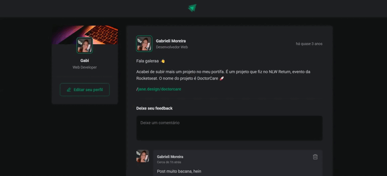

<h1 align="center">Ignite Feed - Typescript 🚀</h1>
<br>

<p align="center">
    
</p>
<p align="center">
    
</p>

> Projeto de estudo realizado durante a formação de ReactJS da Rocketseat.


## 📌 Sobre o projeto

Este projeto foi desenvolvido durante o módulo de **"Fundamentos do ReactJS"** na formação da Rocketseat, proporcionando uma introdução prática ao ecossistema do React e suas principais ferramentas.

Trata-se de uma aplicação de feed interativo onde os usuários podem visualizar e interagir com publicações. A plataforma permite adicionar e remover comentários nos posts, além de aplaudir comentários de outros usuários, incentivando a participação e o engajamento na comunidade.


### 🎨 Protótipo:

O protótipo do projeto pode ser acessado em: 🔗 <a href="https://www.figma.com/design/3vmiSNfnP0qPCmsa9unorB/Ignite-Feed?m=auto&t=IhgECG6PM4gsnGRq-6" target="_blank">Figma</a>


### ⚡ Funcionalidades:

O projeto conta com diversas funcionalidades para garantir uma experiência interativa e dinâmica. Entre elas, destacam-se:

- 📋 Listagem de Posts

- ➕ Adição de novos comentários

- ❌ Exclusão de comentários

- 👏🏻 Aplaudir comentários


### 🛠️ Tecnologias

- **React 19** • Biblioteca para construção de interfaces declarativas.

- **Typescript 5.7.2** • Superset do JavaScript com tipagem estática.

- **Vite 6.0.5** • Ferramenta de build.

- **ESLint** • Ferramenta para análise e padronização de código.

- **Phosphor React** • Biblioteca de ícones personalizáveis.

- **Date-fns** • Biblioteca para manipulação de datas.


## 🚀 Rodando o Projeto

### 💻 Pré-requisitos

Antes de começar, verifique se você atendeu aos seguintes requisitos:

- Você instalou a versão mais recente do `Node.js`
- Você instalou um gerenciador de pacotes: `npm` ou `yarn`.

### 📦 Instalando as Dependências

```bash
# Clone o repositório:
git clone https://github.com/gabrielimoreira/rocketseat-fundamentos-reactjs.git

# Acesse a pasta do projeto:
cd rocketseat-fundamentos-reactjs

# Instale as dependências:
npm install | yarn install
```

### ☕ Usando Ignite Feed

Para rodar, inicie o projeto com:

```
npm run dev | yarn dev
```

> Normalmente, a aplicação estará disponível em: ➡️ http://localhost:5173/

### 🔍 Verificar o Linter

Para garantir que o código segue as boas práticas:

```
npm run lint
```
